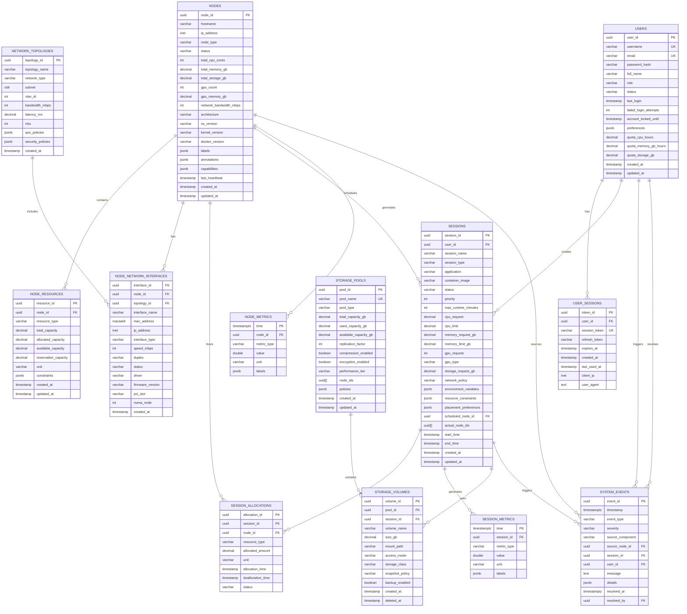

```mermaid
erDiagram
    %% Core User Management
    USERS {
        uuid user_id PK
        varchar username UK
        varchar email UK
        varchar password_hash
        varchar full_name
        varchar role
        varchar status
        timestamp last_login
        int failed_login_attempts
        timestamp account_locked_until
        jsonb preferences
        decimal quota_cpu_hours
        decimal quota_memory_gb_hours
        decimal quota_storage_gb
        timestamp created_at
        timestamp updated_at
    }

    USER_SESSIONS {
        uuid token_id PK
        uuid user_id FK
        varchar session_token UK
        varchar refresh_token
        timestamp expires_at
        timestamp created_at
        timestamp last_used_at
        inet client_ip
        text user_agent
    }

    %% Node Infrastructure
    NODES {
        uuid node_id PK
        varchar hostname
        inet ip_address
        varchar node_type
        varchar status
        int total_cpu_cores
        decimal total_memory_gb
        decimal total_storage_gb
        int gpu_count
        decimal gpu_memory_gb
        int network_bandwidth_mbps
        varchar architecture
        varchar os_version
        varchar kernel_version
        varchar docker_version
        jsonb labels
        jsonb annotations
        jsonb capabilities
        timestamp last_heartbeat
        timestamp created_at
        timestamp updated_at
    }

    NODE_RESOURCES {
        uuid resource_id PK
        uuid node_id FK
        varchar resource_type
        decimal total_capacity
        decimal allocated_capacity
        decimal available_capacity
        decimal reservation_capacity
        varchar unit
        jsonb constraints
        timestamp created_at
        timestamp updated_at
    }

    NODE_NETWORK_INTERFACES {
        uuid interface_id PK
        uuid node_id FK
        uuid topology_id FK
        varchar interface_name
        macaddr mac_address
        inet ip_address
        varchar interface_type
        int speed_mbps
        varchar duplex
        varchar status
        varchar driver
        varchar firmware_version
        varchar pci_slot
        int numa_node
        timestamp created_at
    }

    %% Session Management
    SESSIONS {
        uuid session_id PK
        uuid user_id FK
        varchar session_name
        varchar session_type
        varchar application
        varchar container_image
        varchar status
        int priority
        int max_runtime_minutes
        decimal cpu_request
        decimal cpu_limit
        decimal memory_request_gb
        decimal memory_limit_gb
        int gpu_request
        varchar gpu_type
        decimal storage_request_gb
        varchar network_policy
        jsonb environment_variables
        jsonb resource_constraints
        jsonb placement_preferences
        uuid scheduled_node_id FK
        uuid[] actual_node_ids
        timestamp start_time
        timestamp end_time
        timestamp created_at
        timestamp updated_at
    }

    SESSION_ALLOCATIONS {
        uuid allocation_id PK
        uuid session_id FK
        uuid node_id FK
        varchar resource_type
        decimal allocated_amount
        varchar unit
        timestamp allocation_time
        timestamp deallocation_time
        varchar status
    }

    %% Network Infrastructure
    NETWORK_TOPOLOGIES {
        uuid topology_id PK
        varchar topology_name
        varchar network_type
        cidr subnet
        int vlan_id
        int bandwidth_mbps
        decimal latency_ms
        int mtu
        jsonb qos_policies
        jsonb security_policies
        timestamp created_at
    }

    %% Storage Infrastructure
    STORAGE_POOLS {
        uuid pool_id PK
        varchar pool_name UK
        varchar pool_type
        decimal total_capacity_gb
        decimal used_capacity_gb
        decimal available_capacity_gb
        int replication_factor
        boolean compression_enabled
        boolean encryption_enabled
        varchar performance_tier
        uuid[] node_ids
        jsonb policies
        timestamp created_at
        timestamp updated_at
    }

    STORAGE_VOLUMES {
        uuid volume_id PK
        uuid pool_id FK
        uuid session_id FK
        varchar volume_name
        decimal size_gb
        varchar mount_path
        varchar access_mode
        varchar storage_class
        varchar snapshot_policy
        boolean backup_enabled
        timestamp created_at
        timestamp deleted_at
    }

    %% Time-Series Tables (TimescaleDB)
    NODE_METRICS {
        timestamptz time PK
        uuid node_id FK
        varchar metric_type
        double value
        varchar unit
        jsonb labels
    }

    SESSION_METRICS {
        timestamptz time PK
        uuid session_id FK
        varchar metric_type
        double value
        varchar unit
        jsonb labels
    }

    SYSTEM_EVENTS {
        uuid event_id PK
        timestamptz timestamp
        varchar event_type
        varchar severity
        varchar source_component
        uuid source_node_id FK
        uuid session_id FK
        uuid user_id FK
        text message
        jsonb details
        timestamptz resolved_at
        uuid resolved_by FK
    }

    %% Relationships
    USERS ||--o{ USER_SESSIONS : has
    USERS ||--o{ SESSIONS : creates
    USERS ||--o{ SYSTEM_EVENTS : triggers
    USERS ||--o{ SYSTEM_EVENTS : resolves

    NODES ||--o{ NODE_RESOURCES : contains
    NODES ||--o{ NODE_NETWORK_INTERFACES : has
    NODES ||--o{ SESSION_ALLOCATIONS : hosts
    NODES ||--o{ SESSIONS : schedules
    NODES ||--o{ NODE_METRICS : generates
    NODES ||--o{ SYSTEM_EVENTS : sources

    NETWORK_TOPOLOGIES ||--o{ NODE_NETWORK_INTERFACES : includes

    SESSIONS ||--o{ SESSION_ALLOCATIONS : allocates
    SESSIONS ||--o{ SESSION_METRICS : generates
    SESSIONS ||--o{ STORAGE_VOLUMES : uses
    SESSIONS ||--o{ SYSTEM_EVENTS : triggers

    STORAGE_POOLS ||--o{ STORAGE_VOLUMES : contains
```
